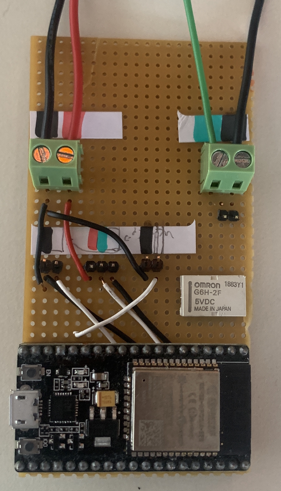

# Level2_Lights
lights made out of neopixels for deco in Level2. 

The two rgbw strands are connected to the ESP32 on pin 13 and 22. The neopixels strand is on pin 23. 

Here is an image of the "PCB", not clean but it works. I also put a relay on it and I am planning on using that to turn on the PSU, but for now, there are 2 jumpers on the board which shorts the green wire to ground.
As you can see the datalines connect directly to the board, the power is supplied direclty to the String trought either a molex connector or wired in. 
